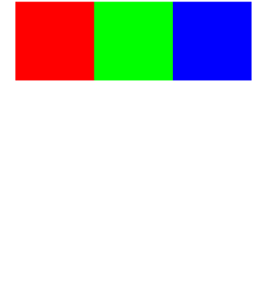

# NUAnimationKit

<!--[](https://travis-ci.org/Victor/NUAnimationKit)
[](http://cocoapods.org/pods/NUAnimationKit)
[](http://cocoapods.org/pods/NUAnimationKit)
[](http://cocoapods.org/pods/NUAnimationKit)
-->
UIView animation wrapper to facilitate chaining of animation commands.

###Problem
Chaining of UIView animations requires the use of completion handler blocks to chain commands together:

```objc
[UIView animateWithDuration:1
                     animations:^
     {
         //animations
     } completion:^(BOOL finished) {
         if (finished) {
             [UIView animateWithDuration:1
                              animations:^
              {
                  //Next animation block
              } completion:^(BOOL finished) {
                  if (finished) {
                      [UIView animateWithDuration:1
                                       animations:^
                       {
                           //Next animation block
                       } completion:^(BOOL finished) {
                           //And so on..
                       }];
                  }
              }];
         }
     }];
```
Which isn't a particularly elegant solution, and is hard to read.

###Enter NUAnimationKit
This library creates a wrapper around UIView animations that facilitates chaining via a simple syntax:

```objc
NUAnimationController *controller = [[NUAnimationController alloc] init];

[controller addAnimation:^{
    //First stage of animations
}].andThen(^{
	//Executes once after the block is done, no animations here.
});

//Chains next animation
[controller addAnimation:^{
    //Second stage of animations
}];
```
To achieve chaining in different objects:

<p align="center">

</p>

NUAnimationKit also allows you to set animation options on creation:

```objc
[controller addAnimation:^{
    //Animations
}].withDelay(0.1).withDuration(0.3).withCurve(UIViewAnimationCurveEaseInOut);
```

And spring-based animations:

```objc
controller addAnimation:^{
    //Springy
}].withType(NUAnimationTypeSpringy).withDuration(NUSpringAnimationNaturalDuration)
```
Where `NUSpringAnimationNaturalDuration ` is a constant that will automatically calculate the optimal spring animation duration based on physical properties like *mass* and *elastic constant*.

Like so:

<p align="center">

</p>

And also adds support for progress-based blocks, for properties that may not be directly animatable:

```objc
[controller addAnimation:^{
    //Main animation
}].alongSideBlock(^(CGFloat progress){
    progressLabel.text = [NSString stringWithFormat:@"%f", progress];
});
```
Like setting a string value:

<p align="center">

</p>

## Installation

NUAnimationKit is available through [CocoaPods](http://cocoapods.org). To install
it, simply add the following line to your Podfile:

```ruby
pod "NUAnimationKit"
```

## Usage
To use the library, simply:

- Install the pod by adding `pod "NUAnimationKit"` to your podfile
- Import `NUAnimationController.h`
- Create an animation controller: `NUAnimationController *controller = [[NUAnimationController alloc] init];`
- Add animation blocks:

```objc
controller addAnimation:^{
    //Springy
}].withType(NUAnimationTypeSpringy).withDuration(NUSpringAnimationNaturalDuration)
```
- Start the animation: 

```
[controller startAnimationChain]
```
or

```objc
[controller startAnimationChainWithCompletionBlock:^{
//Optional completion block
}];
```

- Profit

## Requirements
Built for iOS 8.0 and above.

## Author

Victor Maraccini, 
victor.maraccini@nubank.com.br

## License

NUAnimationKit is available under the MIT license. See the LICENSE file for more info.
